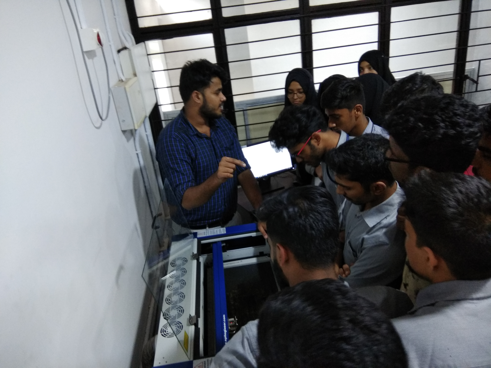
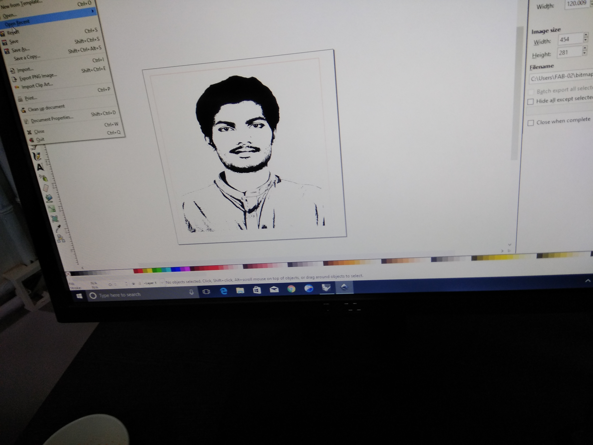
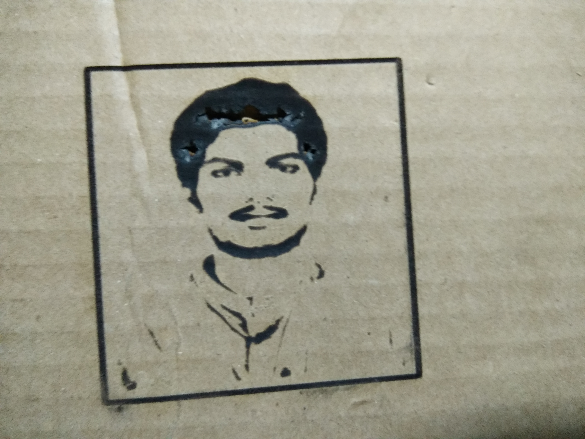
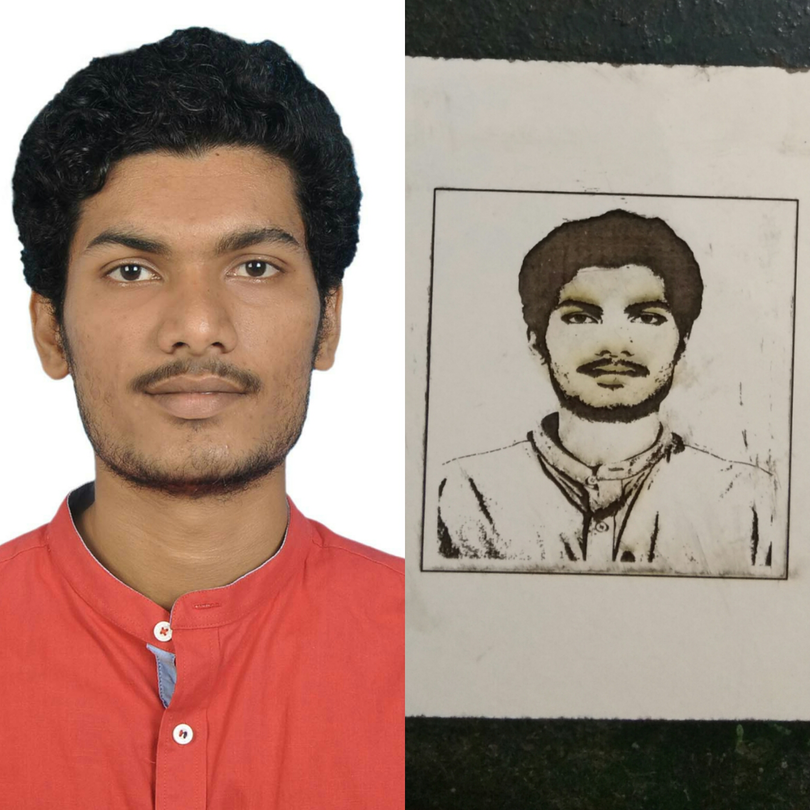

# Sarath Kumar T S
my fab lab experiences.
 
## About me:
 

I am a final year mechanical engineering student pursuing my graduation from MES college of engineering, Kuttipuram. 
This is a diary of my fablab experience. Click <a href="https://www.facebook.com/sarath.roddick"> here </a> to meet me in facebook.
Check this blog periodically for more updates about 3D printer, vinyl cutting, pcb milling & laser cutting machine.  Contact me:  phone:9497095392 email:sarathtsukumaran4@gmail.com
    

## What is a Fablab?

Fablab or fabrication lab is a small scale workshop equipped with computer controlled tools with the aim to make "ALMOST ANYTHING".

   
## Fab lab in MESCE
 

 There are around 22 fablabs in kerala. Fablab Kochi, Fablab Trivandrum and other 20 labs are in engineering colleges. Mes college of engineering is one among them. They have a well develepod fablab in which student and faculty development programs are taking place. Fablab in MESCE consists of the below mentioned machines.
  

   
  
 
## 3D Printer
 
  

  3D printer is a machine allowing the creation of a physical object from a three-dimensional digital model, typically by laying down many thin layers of a material in succession.
  

## PCB Milling Machine
  

 
Printed circuit board milling (also: isolation milling) is the process of removing areas of copper from a sheet of printed circuit board material to recreate the pads, signal traces and structures according to patterns from a digital circuit board plan known as a layout file.
  

## Vinyl Cutting Machine
  

  A vinyl cutter is a type of computer-controlled machine. Small vinyl cutters look like computer printers. The computer controls the movement of a sharp blade. This blade is used to cut out shapes and letters from sheets of thin self-adhesive plastic (vinyl).
  
## Day 1
  
 It is really proud to say that i was a member of the first student development program in the fablab.
 Our instructor Mr. Jaseel gave us a brief explanation of fablab and the scope of fablab. 
 His words was so impressive that many of us including me thought of taking fablab as a carrier option. 
 He also explained about the overall works to be done in this 2 week workshop. 
 He introduced new websites to us and asked us to make our own websites. 
    
## Day 2
     Jaseel sir introduced us to the various equipments in the lab. Those equipments are mentioned above. Today we learned how to do documentation. After that the whole batch was grouped into 2 groups for further convenience. That's all for the day. Stay tuned for more updates.
   
## Day 3
   Today we learned Rhino software and designing using that. Made a small 3D printer model and also printed it. Also had a brief knowledge about the working of 3D printer. 

  
## Day 4
  
Today was an extrordinary day because we learned to use almost every machine in the lab. First of all, we learned to design and print pcb using fabmodules and shopboat software.   

  
Next we learned to use vinyl cutter. The software used for this is Cut Studio.   

  
Then we moved on to laser cutter for which we can use any designing softwares to design.   
    
We also did some engraving work using laser cutter 

 
#### Engraving on cardboard:

  

#### Engraving on mica board:

   
Stay tuned for more updates...
