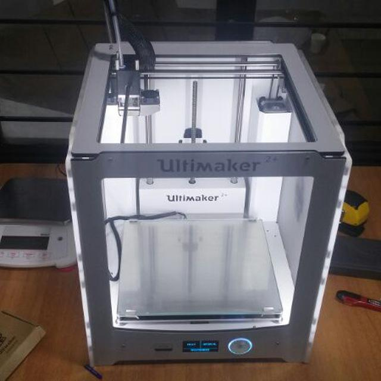
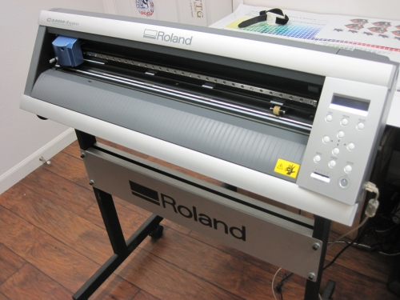

# Sarath Kumar T S
my fab lab experiences.
 
## About me:
 

I am a final year mechanical engineering student pursuing my graduation from MES college of engineering, Kuttipuram. 
This is a diary of my fablab experience. Click <a href="https://www.facebook.com/sarath.roddick"> here </a> to meet me in facebook.
Check this blog periodically for more updates about 3D printer, vinyl cutting, pcb milling & laser cutting machine.  Contact me:  phone:9497095392 email:sarathtsukumaran4@gmail.com
    

## What is a Fablab?

Fablab or fabrication lab is a small scale workshop equipped with computer controlled tools with the aim to make "ALMOST ANYTHING".

   
## Fab lab in MESCE
 

 There are around 22 fablabs in kerala. Fablab Kochi, Fablab Trivandrum and other 20 labs are in engineering colleges. Mes college of engineering is one among them. They have a well develepod fablab in which student and faculty development programs are taking place. Fablab in MESCE consists of the below mentioned machines.
  

   
  
 
## 3D Printer
 
  

  3D printer is a machine allowing the creation of a physical object from a three-dimensional digital model, typically by laying down many thin layers of a material in succession.
  

## PCB Milling Machine
  

 
Printed circuit board milling (also: isolation milling) is the process of removing areas of copper from a sheet of printed circuit board material to recreate the pads, signal traces and structures according to patterns from a digital circuit board plan known as a layout file.
  

## Vinyl Cutting Machine
  

  A vinyl cutter is a type of computer-controlled machine. Small vinyl cutters look like computer printers. The computer controls the movement of a sharp blade. This blade is used to cut out shapes and letters from sheets of thin self-adhesive plastic (vinyl).
  
## SYLLABUS 
Day 1 : Introduction to Fablab   

Day 2 : Github Pages and Documentation  
                               
Day 3: Electronics Production and CNC  
                                
DAY 4 : Vinyl Cutting  
                                	
DAY 5 : Screen Printing  
                                	
DAY 6 : 3D Printing  
                                
Day 7 : Laser Cutting, Moulding and Casting  
                                
Project

## Day 1
  
 It is really proud to say that i was a member of the first student development program in the fablab.
 Our instructor<a href="http://archive.fabacademy.org/archives/2016/fablabtrivandrum/students/390/"> Mr. Jaseel</a> gave us a brief explanation of fablab and the scope of fablab. 
 His words was so impressive that many of us including me thought of taking fablab as a carrier option. 
 He also explained about the overall works to be done in this 2 week workshop and introduced new websites to us and asked us to make our  own websites. 
    
## Day 2
     Jaseel sir introduced us to the various equipments in the lab. Those equipments are mentioned above. Today we learned how to do documentation. After that the whole batch was grouped into 2 groups for further convenience. We started documenting.   
## Day 3 
   Today we learned Rhino software and designing using that. Made a small 3D printer model and also printed it. Also had a brief knowledge about the working of 3D printer. 

  
## Day 4
  
Today was an extrordinary day because we learned to use almost every machine in the lab. First of all, we learned to design and print pcb using fabmodules and shopboat software.   

  
Next we learned to use vinyl cutter. The software used for this is Cut Studio.
### To cut texts:  
*Open Cut Studio. 
Select the Text option. 
Type the text to be printed. 
Select the text and go to the Properties option to change the font size and style.  
Press Ok button*.  
### Printing using vinyl printer: 
*Power on the printer. 
Release the sheet holder and keep the sheet inside the printer. 
Adjust the length of work by changing the position of limiters. 
Always ensure that the limiters are in between the white marks in the printer. 
Now engage the sheet holder. 
Select the type of the sheet(roll, piece, edge) in which the work is to be done 
Now set the point to start the work by using the navigation button on the machine. 
Long press 'Origin' button to set the origin. 
Now click 'Print' from the File menu 
Release the sheet holder after printing and cut out the required portion from the sheet. 
Now cover the cut out portion using a masking sheet. 
After removing the masking sheet the required portion to be pasted will hold on to the mask. 
Now stick mask sheet on required place and remove the mask sheet using small forceps*
  

  
### Printing images: 
You can also print images just like texts. Follow these steps to print images using 3D printer. 
*You can design your file in any of the design softwares or transform a photo file into a design. 
First download or select the required image. 
Open it in any photo editting softwares. 
Select click on 'Image processing' and select 'NEON' to get the outline. 
Delete the original image. 
Adjust the height and width according to your wish. 
Select 'Print' from 'FILE' menu. 
Select the Vinyl printer from print setup.*  
## Day 5
  
## How to use Laser Cutter
  
*Load the design file using any designing softwares. 
Select the Print option from the File menu. 
Select the laser cutter from Select printer menu. 
Choose the required power and speed. 
Choose between Vector and Raster options.* 

### NOTE: 

You can control how much power will be applied to the laser while printing. The more power- the more heat, and the more heat- the greater the chance of fire. 

The speed you choose, determines how fast the laser will travel while cutting. The slower the speeds, the longer the laser sits in each spot, which yields more heat. It also means that the slower the speed, the deeper the cut or engraving will be. 
 

### NOTE: 

Raster tends to be used for engraving things, while vector is much more adept at cutting things out.  

## Day 6  

## How to use a 3D printer
  
*Design the work using any of design softwares. 
Save the file in STL format. 
Open the file in 'CURA'. 
Use the Adjustment Tools to position, scale and rotate the object if desired. 
In the Sidebar, select the nozzle size and material you want to use. Make sure it matches the setup on the printer. 
Select Helper Parts on the Sidebar. Set the desired strength and enable or disable support and build plate adhesion. 
To view the result of the selected profile and support settings, go to the “View mode” and select “Layers”.
In the bottom right corner, select “Save file” or “Save to USB” to save the print file.*  
My model in Cura software 

My multi holder:

  

